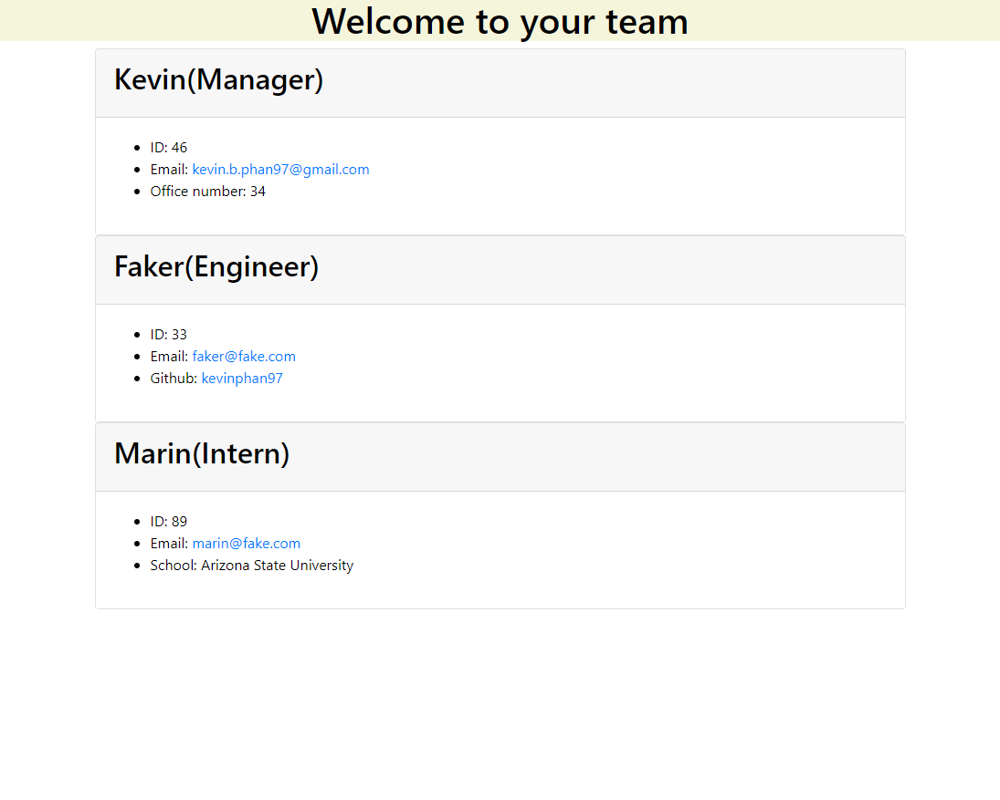

# Team Profile Generator

  ## Table of Contents
  -[Description](#description) 
  -[Installation](#installation) 
  -[Usage](#usage) 
  -[License](#license) 
  -[Contribution](#contribution) 
  -[Sample](#sample) 
  -[Questions](#questions) 

  ## Description
  This terminal application uses inquirer for questions and jest for testing.

  ## Installation
  To use this application, please install inquirer using the command "npm i inquirer".

  ## Usage
  When first launching the application in ther terminal, the user will be prompt with adding the manager's information. After adding the manager, the user will be asked if they want to add an engineer or an intern. More prompts will followdepending on which job is chosen. Once the user is done adding other team members, an html will be created showing the end result.

  ## License
  The license for this application is: 

  ## Contribution
  No contribution.

  ## Sample
  

  ## Questions
  You can find my repositories on GitHub: [https://github.com/kevinphan97]
  If you have any questions feel free to email me at: kevin.b.phan97@gmail.com
